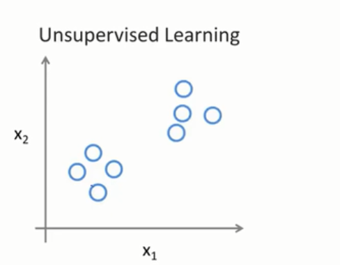

# 无监督学习

## 监督学习和无监督学习的区别

监督学习的数据集是如下：

每个样本都被标明了阳性样本或者阴性样本，即阴性肿瘤或者阳性肿瘤（有标签）

与之相反，无监督学习的数据集并没有告诉其中某个样本是阴性或者阳性（无标签），而是让你去在从该数据中找到某种结构。对于以上数据集，无监督学习可以发现该数据包含两个簇，无监督可以将数据分成两个簇（聚类算法）

## 鸡尾酒会问题

一个宴会中有一屋子人，大家都在一起说话，每个人都同时说话，很多声音混在一起，所以很难听清你身边人的说话。假设鸡尾酒会只有两个人，两人同时说话，我们将两个麦克风放在屋子里，麦克风与这两个人距离不同，麦克风记录了两个人的声音的不同组合

我们希望麦克风1仅仅输出第一个人，麦克风2仅仅输出第二个人，这里用到鸡尾酒算法

实现该算法的代码：

