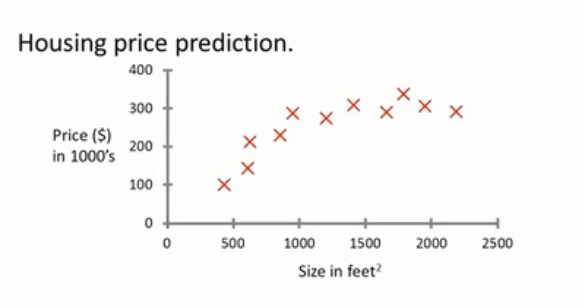
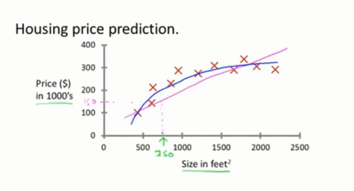
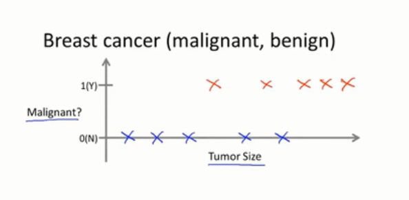
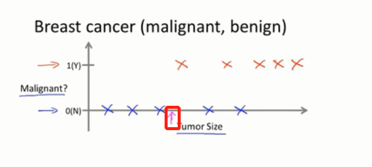
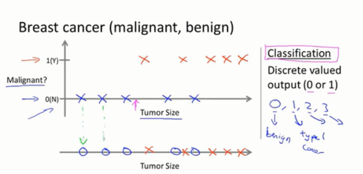
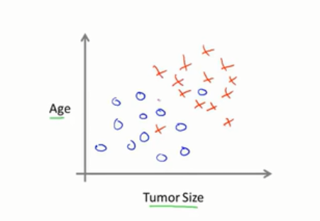
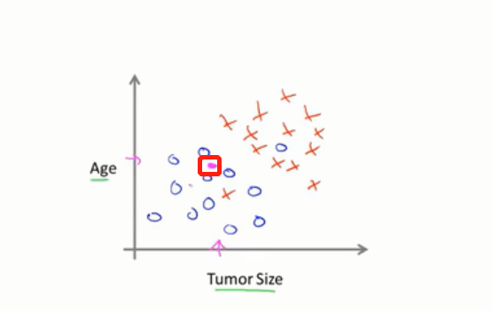
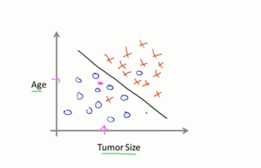

# 监督学习

## 房价例子

通过这次视频我们会定义机器学习最常见的类型，也就是监督学习，之后我们会给出监督学习更为贴切的定义，首先我们会从例子开始解释，再下一个具体的定义。

不久之前，一个学生从俄勒冈的波特兰市收集数据，假设我们绘制了这样一个数据集，就像这样。

- 横走是不同房屋的平方英尺数
- 纵轴是房屋的价格，单位是千美元

假设你的朋友有一栋750平米的英尺的房子，他想要卖掉这所房子，他想知道这所房子按照市场价格可以卖出什么价格。

那么学习算法可以帮助你做什么呢？

学习算法能做的第一件事情就是根据数据画出一条直线，或者说用一条直线来拟合数据，基于此看上去，房子可以卖15万美元。但是这可能不是你能使用的唯一的学习算法。可能有一个更好的，例如用一条曲线来拟合数据，可能使用二阶函数或者二阶多项式来拟合曲线效果可能会更好。

假设你那么做了，那么在这里做一个预测，看上去他卖出的接近20万美元，后面我们要讨论的就是如何选择如何决定是用直线来拟合数据还是用二次函数来拟合数据。当然无论选择哪一个模型都不会让你的朋友的房子卖的更好，但是这是一个非常好的关于学习算法的例子。这是一个监督学习算法的例子。

## 监督学习的定义

监督学习是指我们给算法一个数据集其中包含了正确的答案，也就是我们给定一个房价的数据集，在这个数据集的每个样本，我们都给出了正确的价格，即这个房价的实际卖出价格。算法的目的就是给出更多的答案，例如为你朋友想要卖掉这所新房子给出的估价，用更专业的话语来说，这类问题也被称作回归问题。

## 回归问题的定义

回归问题是指我们想要预测连续的数值输出，也就是价格，技术上而言价格可以被估计到园整到分，因此价格实际上是一个离散值，标量或者连续值，回归这个术语是指我们设法预测连续值的属性

## 预测恶性肿瘤案例

这里是另外一个监督学习的例子，假设你想看医疗记录，并设法预测乳腺癌是恶性还是良性，假设某人发现了一个乳腺肿瘤，即乳房上的肿块，恶性肿瘤就是有害且危险的，良性肿瘤就是无害的，显然人们非常关系这个。我们来看一下收集的数据集，假设在你的数据集中，横轴是肿瘤的尺寸，纵轴是1或者0，代表是或者否。假设你的数据集就像这样

假设蓝色的点代表良心肿瘤，红色的点代表恶性的肿瘤，下面的一行中有五个良性肿瘤的样本，五个恶性肿瘤的样本，对应纵轴上的1，假设我们有个朋友不行患了乳腺肿瘤，假设她的乳腺肿瘤大小可能在某个值附近，比如图中粉色箭头所示。

那么机器学习要根据该肿瘤的大小来判断该肿瘤是良性肿瘤或者是恶性肿瘤的概率，用更加专业的术语来说，这就是一个分类的问题，分类问题是指，我们设法预测一个离散值的输出，0或者1，恶性或者良性，实际在分类问题中，有时候你也有可能有两个以上的可能的输出值，在实际的例子中，可能有三种类型的乳腺癌，因此你可能要设法预测离散的值0，1，2或者3，其中0是良性的，良性瘤，良性瘤也就是没有癌症，1就是第一种三种中的一种，2就是指第二种癌症，3就是指第三种癌症，这也是一种分类问题，因为这又是一组离散的输出值。

在分类问题中有另外一种方法来绘制这种数据，我会用一组不用的符号来绘制这组数据，如果肿瘤的大小是我用来良性或者恶性的特征，我们也可以绘制数据，我将会用不同的符号来表示恶性或者良性。

现在我用O而不是X来表示良性肿瘤，还是继续用X来表示恶性肿瘤，我所做的就是将上面的数据集对应下来，从上面对应下来到这条直线上，并且是使用不同的符号，圆圈或者是叉，表示恶性或者是良性样本，在这个例子中我们仅仅是使用了一个特征或者说是属性，也就是肿瘤的大小来预测肿瘤是良性还是恶性，在其他的机器学习的问题中，我们会有多个特征，多个属性，这里有个例子。

假设我们不仅仅知道肿瘤的大小，还知道病人的年龄，在这种情况下你的数据集是这样的，我们有一组病人是这样年两的肿瘤的大小是这样的，蓝色的圈圈，另外一组病人则是不同的，是红色的叉叉。

假设你有一个朋友，很不幸的有一个瘤，可能他的肿瘤大小或者年纪是在这里

因此在给定的数据集上，学习算法可以做的是在数据上画出一条直线，设法将恶性肿瘤和良性肿瘤分开，学习算法可能会决定用这样的一条直线来分开这两类瘤

你就可以通过这个来判断你朋友的肿瘤的类型，假设在粉色点的位置，你的学习算法就会认为，你的朋友的瘤位于良性的区域，也就是良性的可能性比恶性大，在其他机器学习算法中往往会有更多的特征，比如肿瘤的厚度、肿瘤细胞大小的均匀性以及其他的特征。那么如何处理无穷多的特征呢？如何在计算机中存储无穷多数量的事物，因为你的计算机内存可能会溢出，以支撑向量机算法为例子，就有一个灵巧的数学技巧，允许计算机计算无穷多的特征，假设我这里面不仅仅写了两个特征和后面三个特征，假设写下无穷长的列表，其实我们可以设计算法处理这种情况

## 总结

- 本小节讨论了监督学习，想法是在监督学习中对于数据集中的每一个样本
- 我们想要通过算法来进行预测并得到正确的答案，比如房子的价格或者肿瘤的良性或者恶性
- 我们还讨论了回归问题，回归是指我们的目标值是一个连续值的输出
- 我们还讨论了分类问题，分类问题是一个离散值的输出

